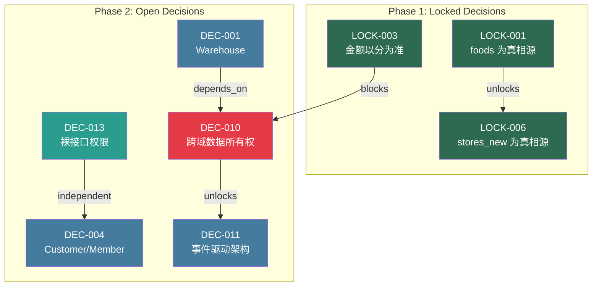

# Decision Dependency Graph

> PROJECT-DECISION-RECON-001 | Generated: 2026-09-09

## Overview

This document maps the dependency relationships between all locked and open decisions in the decision recon phase. It defines which decisions block, depend on, or unlock others, and establishes the correct lock order based on business logic dependencies.

---

## Decision Inventory

| ID | Name | Status | Tag |
|---|---|---|---|
| LOCK-001 | foods 为真相源 | LOCKED | — |
| LOCK-003 | 金额以分为准 | LOCKED | — |
| LOCK-006 | stores_new 为真相源 | LOCKED | — |
| DEC-001 | Warehouse | OPEN | DEPENDS_ON → DEC-010 |
| DEC-004 | Customer/Member | OPEN | DEPENDS_ON → DEC-013 |
| DEC-010 | 跨域数据所有权 | OPEN | BLOCKED_BY → LOCK-003, DEC-001; BLOCKS → DEC-011 |
| DEC-011 | 事件驱动架构 | OPEN | DEPENDS_ON → DEC-010 |
| DEC-013 | 裸接口权限 | OPEN | INDEPENDENT |

---

## Dependency Matrix

```
                    ┌──────────┐
                    │ LOCK-001 │  foods 为真相源
                    └────┬─────┘
                         │ unlocks
                         ▼
                    ┌──────────┐
                    │ LOCK-006 │  stores_new 为真相源
                    └──────────┘

                    ┌──────────┐
                    │ LOCK-003 │  金额以分为准
                    └────┬─────┘
                         │ blocks
                         ▼
                    ┌──────────┐
                    │ DEC-010  │  跨域数据所有权
                    └──┬───┬──┘
                       │   │
          ┌────────────┘   └────────────┐
          │ depends on                  │ unlocks
          ▼                             ▼
    ┌──────────┐                  ┌──────────┐
    │ DEC-001  │  Warehouse      │ DEC-011  │  事件驱动架构
    └──────────┘                  └──────────┘

    ┌──────────┐
    │ DEC-013  │  裸接口权限       ← INDEPENDENT
    └────┬─────┘
         │ unlocks
         ▼
    ┌──────────┐
    │ DEC-004  │  Customer/Member
    └──────────┘
```

---

## Mermaid Diagram



---

## Detailed Dependency Descriptions

### LOCK-001 → LOCK-006

- **Type**: UNLOCKS
- **Business Logic**: foods 数据表被确立为食物相关的唯一真相源后，stores_new 的角色和边界才能被精确锁定。两者共享门店-食物关联维度，LOCK-001 的粒度决定了 LOCK-006 需要保留哪些字段作为事实。

### LOCK-003 → DEC-010

- **Type**: BLOCKS
- **Business Logic**: 金额单位锁定为"分"(整数)后，跨域数据所有权的归属问题才能被决策——因为不同域(订单、财务、库存)对金额精度的要求不同，必须先统一精度标准再定义域边界。

### DEC-001 → DEC-010

- **Type**: DEPENDS_ON
- **Business Logic**: Warehouse 功能范围未定之前，无法确定库存域和订单域之间的数据所有权划分。DEC-001 的产出直接约束 DEC-010 的域边界定义。

### DEC-010 → DEC-011

- **Type**: UNLOCKS
- **Business Logic**: 跨域数据所有权确定后，事件驱动的触发点、事件契约和数据契约才能被精确设计。DEC-010 的域边界定义是 DEC-011 事件 schema 的前置条件。

### DEC-013 → DEC-004

- **Type**: UNLOCKS
- **Business Logic**: 裸接口权限模型确定后，Customer/Member 模块的接口设计和权限策略才能被最终决策。DEC-013 提供了权限基座，DEC-004 在其上构建业务逻辑。

---

## Decision Lock Order

Based on the dependency chain analysis, the correct lock order is:

```
┌─────────┬──────────────────────┬───────────────────────────────────────────┐
│ Order   │ Decision             │ Reason                                   │
├─────────┼──────────────────────┼───────────────────────────────────────────┤
│ 1       │ LOCK-001             │ Foundation: foods 为真相源 (已锁定)       │
│ 2       │ LOCK-006             │ Derives from LOCK-001 (已锁定)           │
│ 3       │ LOCK-003             │ Foundation: 金额以分为准 (已锁定)         │
│ 4       │ DEC-013              │ INDEPENDENT, no upstream deps             │
│ 5       │ DEC-001              │ BLOCKED_BY → DEC-010 (resolved after 6) │
│ 6       │ DEC-010              │ BLOCKED_BY → LOCK-003 ✓, DEC-001 ✓      │
│ 7       │ DEC-004              │ DEPENDS_ON → DEC-013 ✓ (resolved at 4)  │
│ 8       │ DEC-011              │ DEPENDS_ON → DEC-010 ✓ (resolved at 6)  │
└─────────┴──────────────────────┴───────────────────────────────────────────┘
```

> **Note**: LOCK-001 and LOCK-006 are already locked and serve as immutable anchors. The open decisions (DEC-*) must be resolved in the order above to satisfy all dependency constraints.

---

## Blocking Chain Summary

```
LOCK-001 ──unlocks──▶ LOCK-006 ──────────────────────────────────────┐
                                                                      │
LOCK-003 ──blocks───▶ DEC-010 ◀──depends_on── DEC-001                 │
                          │                                           │
                       unlocks                                        │
                          │                                           │
                          ▼                                           │
                      DEC-011 ◀───────────────────────────────────────┘

DEC-013 ──independent─▶ DEC-004
```

**Critical Path**: `LOCK-003 → DEC-010 → DEC-011`
This is the longest dependency chain and should be prioritized in resolution.

---

*This graph should be re-evaluated as new decisions are locked or open decisions are resolved.*
