# Decision Dependency Graph v2 — Full DAG

> **Version**: 2.0
> **Generated**: 2026-09-09
> **Status**: ACTIVE
> **Scope**: Decision Baseline Integrity & Conflict Reconciliation — Full Dependency Coverage

---

## 1. Decision Inventory (全量清单)

### 1.1 LOCKED (已锁定 — 不可变锚点)

| Lock ID | 决策内容 | Truth Source | 状态 |
|---------|---------|-------------|------|
| **LOCK-001** | React + TypeScript 作为前端技术栈 | 8个前端应用已部署 | 🔒 LOCKED |
| **LOCK-002** | Redux Toolkit 作为状态管理方案 | 全局状态管理已部署 | 🔒 LOCKED |
| **LOCK-003** | React Router v6 作为路由方案 | 前端路由已统一 | 🔒 LOCKED |
| **LOCK-004** | Ant Design 5.x 作为 UI 组件库 | 企业级组件已使用 | 🔒 LOCKED |
| **LOCK-005** | Vite 作为构建工具 | 前端构建已标准化 | 🔒 LOCKED |
| **LOCK-006** | ESLint + Prettier 作为代码规范 | 代码风格已统一 | 🔒 LOCKED |
| **LOCK-007** | Vitest + React Testing Library 作为测试框架 | 前端测试已标准化 | 🔒 LOCKED |
| **LOCK-008** | Axios 作为 HTTP 客户端 | API 通信已统一 | 🔒 LOCKED |
| **LOCK-009** | react-i18next 作为国际化方案 | 多语言已实现 | 🔒 LOCKED |
| **LOCK-010** | ECharts 作为数据可视化 | 图表库已标准化 | 🔒 LOCKED |

### 1.2 DEC (原始决策 — 更新状态)

| Decision | 标题 | 类别 | 状态 | 优先级 | 备注 |
|----------|------|------|------|--------|------|
| **DEC-001** | 用户认证方案 — JWT | 安全架构 | ACTIVE | HIGH | — |
| **DEC-002** | 权限控制方案 — RBAC | 安全架构 | ACTIVE | HIGH | — |
| **DEC-003** | 缓存策略 — Redis | 性能架构 | ACTIVE | MEDIUM | — |
| **DEC-004** | 日志方案 — Winston | 工程规范 | ACTIVE | MEDIUM | — |
| **DEC-005** | 消息队列 — RabbitMQ | 架构设计 | ACTIVE | MEDIUM | — |
| **DEC-006** | 数据库选型 — PostgreSQL | 数据架构 | **NEEDS_REVISION** | P1 | 需修订: 分库分表策略 |
| **DEC-007** | ORM 方案 — Prisma | 数据架构 | ACTIVE | LOW | — |
| **DEC-008** | UI 组件定制 — CSS-in-JS | UI/UX | **SUPERSEDED** | — | by LOCK-003 |
| **DEC-009** | 表单方案 — Formily | UI/UX | **NEEDS_REFINEMENT** | MEDIUM | 需细化: Ant Design Form 评估 |
| **DEC-010** | 部署方案 — Docker + K8s | 运维架构 | ACTIVE | MEDIUM | — |
| **DEC-011** | CI/CD 方案 — GitLab CI | 工程规范 | ACTIVE | MEDIUM | — |
| **DEC-012** | 监控方案 — Prometheus + Grafana | 运维架构 | ACTIVE | MEDIUM | — |
| **DEC-013** | 文档方案 — Swagger + TypeDoc | 工程规范 | ACTIVE | LOW | — |
| **DEC-014** | 错误处理 — 统一错误码 | 工程规范 | ACTIVE | LOW | — |

### 1.3 IMPLICIT (隐含决策 — 全部 SUBSUMED)

| Decision | 标题 | 被吸收原因 | 吸收决策 |
|----------|------|------------|----------|
| **IMPLICIT-001** | 前端状态管理 — Redux | Redux Toolkit 完全取代 | LOCK-002 |
| **IMPLICIT-002** | 前端路由 — React Router v5 | React Router v6 完全取代 | LOCK-003 |
| **IMPLICIT-003** | UI 组件 — 自定义组件 | Ant Design 完全取代 | LOCK-004 |
| **IMPLICIT-004** | 构建工具 — Webpack | Vite 完全取代 | LOCK-005 |
| **IMPLICIT-005** | HTTP 客户端 — Fetch API | Axios 完全取代 | LOCK-008 |
| **IMPLICIT-006** | 国际化 — 自定义方案 | react-i18next 完全取代 | LOCK-009 |

---

## 2. DAG Layer Model (分层模型)

```
┌─────────────────────────────────────────────────────────────────────────────────────┐
│                           DECISION DEPENDENCY DAG v2                                │
├─────────────────────────────────────────────────────────────────────────────────────┤
│                                                                                     │
│  LAYER 7: SETTLEMENT (结算层)                                                       │
│  ┌─────────────────────────────────────────────────────────────────────────────┐    │
│  │  (空 — 无决策需要在结算层决策)                                                │    │
│  └─────────────────────────────────────────────────────────────────────────────┘    │
│                              ▲                                                      │
│  LAYER 6: TRANSACTION (交易层)                                                      │
│  ┌─────────────────────────────────────────────────────────────────────────────┐    │
│  │  DEC-013 [Swagger]    DEC-014 [错误码]    DEC-012 [监控]                     │    │
│  └─────────────────────────────────────────────────────────────────────────────┘    │
│                              ▲                                                      │
│  LAYER 5: CAPABILITY (能力层)                                                       │
│  ┌─────────────────────────────────────────────────────────────────────────────┐    │
│  │  DEC-001 [JWT]     DEC-002 [RBAC]    DEC-003 [Redis]    DEC-004 [Winston]   │    │
│  │  DEC-005 [RabbitMQ]  DEC-007 [Prisma]  DEC-010 [K8s]  DEC-011 [GitLab CI]  │    │
│  └─────────────────────────────────────────────────────────────────────────────┘    │
│                              ▲                                                      │
│  LAYER 4: DOMAIN BOUNDARY (域边界层)                                                │
│  ┌─────────────────────────────────────────────────────────────────────────────┐    │
│  │  DEC-006 [PostgreSQL]  DEC-008 [SUPERSEDED]  DEC-009 [Formily]              │    │
│  └─────────────────────────────────────────────────────────────────────────────┘    │
│                              ▲                                                      │
│  LAYER 3: IDENTITY (身份层)                                                         │
│  ┌─────────────────────────────────────────────────────────────────────────────┐    │
│  │  LOCK-002 [Redux]  LOCK-003 [Router]  LOCK-004 [AntD]  LOCK-007 [Vitest]   │    │
│  └─────────────────────────────────────────────────────────────────────────────┘    │
│                              ▲                                                      │
│  LAYER 2: MASTER DATA (主数据层)                                                    │
│  ┌─────────────────────────────────────────────────────────────────────────────┐    │
│  │  LOCK-005 [Vite]  LOCK-006 [ESLint]  LOCK-008 [Axios]  LOCK-009 [i18n]    │    │
│  │  LOCK-010 [ECharts]                                                           │    │
│  └─────────────────────────────────────────────────────────────────────────────┘    │
│                              ▲                                                      │
│  LAYER 1: FOUNDATION (基础层 — 不可变锚点)                                          │
│  ┌─────────────────────────────────────────────────────────────────────────────┐    │
│  │  LOCK-001 [React+TS] — 所有决策的根锚点                                      │    │
│  │  IMPLICIT-001~006 (SUBSUMED — 已被正式决策吸收)                               │    │
│  └─────────────────────────────────────────────────────────────────────────────┘    │
│                                                                                     │
└─────────────────────────────────────────────────────────────────────────────────────┘
```

---

## 3. Full Dependency Matrix (全量依赖矩阵)

### 3.1 LOCKED Dependencies

| Decision | DEPENDS_ON | BLOCKS | UNLOCKS | Tag |
|----------|-----------|--------|---------|-----|
| **LOCK-001** | — | DEC-001, DEC-003, DEC-004, DEC-005, DEC-006, DEC-010, DEC-011, DEC-012, DEC-013, DEC-014 | LOCK-002, LOCK-003, LOCK-004, LOCK-005, LOCK-008, LOCK-009, LOCK-010, DEC-001, DEC-003, DEC-004, DEC-005, DEC-010, DEC-011, DEC-012, DEC-013, DEC-014, IMPLICIT-001~006 | Foundation Anchor |
| **LOCK-002** | LOCK-001 | DEC-004 | DEC-005 | Derived |
| **LOCK-003** | LOCK-001 | DEC-006, DEC-008 | DEC-007 | Derived (SUPERSEDES DEC-008) |
| **LOCK-004** | LOCK-001 | DEC-008, DEC-009 | — | Derived |
| **LOCK-005** | LOCK-001 | DEC-010 | LOCK-007, DEC-011 | Derived |
| **LOCK-006** | — | DEC-012 | DEC-013 | Foundation Anchor |
| **LOCK-007** | LOCK-005 | DEC-014 | — | Derived |
| **LOCK-008** | LOCK-001 | — | — | Derived |
| **LOCK-009** | LOCK-001 | — | — | Derived |
| **LOCK-010** | LOCK-001 | — | — | Derived |

### 3.2 DEC Dependencies

| Decision | DEPENDS_ON | BLOCKS | UNLOCKS | Tag |
|----------|-----------|--------|---------|-----|
| **DEC-001** | LOCK-001 | DEC-002 | DEC-003 | ACTIVE |
| **DEC-002** | DEC-001 | DEC-004 | DEC-005 | ACTIVE (DEADLOCK w/ DEC-001) |
| **DEC-003** | LOCK-001 | DEC-006 | DEC-007 | ACTIVE |
| **DEC-004** | LOCK-001, DEC-002 | DEC-008 | DEC-009 | ACTIVE |
| **DEC-005** | LOCK-001, DEC-002 | DEC-010 | DEC-011 | ACTIVE |
| **DEC-006** | LOCK-001, DEC-003 | DEC-012 | DEC-007 | **NEEDS_REVISION** |
| **DEC-007** | DEC-006 | DEC-014 | — | ACTIVE (DEADLOCK w/ DEC-006) |
| **DEC-008** | LOCK-004 | — | — | **SUPERSEDED** (by LOCK-003) |
| **DEC-009** | LOCK-004 | — | — | **NEEDS_REFINEMENT** |
| **DEC-010** | LOCK-001, LOCK-005 | DEC-011 | — | ACTIVE |
| **DEC-011** | LOCK-001, DEC-010 | — | — | ACTIVE |
| **DEC-012** | LOCK-001, LOCK-006, DEC-006 | — | — | ACTIVE |
| **DEC-013** | LOCK-001, LOCK-006 | — | — | ACTIVE |
| **DEC-014** | LOCK-001, LOCK-007, DEC-007 | — | — | ACTIVE |

### 3.3 IMPLICIT Dependencies (全部 SUBSUMED)

| Decision | DEPENDS_ON | BLOCKS | UNLOCKS | 吸收方 | Tag |
|----------|-----------|--------|---------|--------|-----|
| **IMPLICIT-001** | LOCK-001 | — | — | LOCK-002 | SUBSUMED |
| **IMPLICIT-002** | LOCK-001 | — | — | LOCK-003 | SUBSUMED |
| **IMPLICIT-003** | LOCK-001 | — | — | LOCK-004 | SUBSUMED |
| **IMPLICIT-004** | LOCK-001 | — | — | LOCK-005 | SUBSUMED |
| **IMPLICIT-005** | LOCK-001 | — | — | LOCK-008 | SUBSUMED |
| **IMPLICIT-006** | LOCK-001 | — | — | LOCK-009 | SUBSUMED |

---

## 4. Mermaid DAG (完整依赖图)

```mermaid
graph TD
    %% ============================================================
    %% LAYER 1: FOUNDATION (不可变锚点)
    %% ============================================================
    subgraph "L1: Foundation (不可变锚点)"
        LOCK_001["🔒 LOCK-001<br/>React + TypeScript<br/>─────────<br/>所有决策根锚点"]
    end

    subgraph "L1b: SUBSUMED (已被吸收)"
        IMPLICIT_001["⬜ IMPLICIT-001<br/>状态管理 — Redux<br/>→ SUBSUMED by LOCK-002"]
        IMPLICIT_002["⬜ IMPLICIT-002<br/>路由 — React Router v5<br/>→ SUBSUMED by LOCK-003"]
        IMPLICIT_003["⬜ IMPLICIT-003<br/>UI 组件 — 自定义<br/>→ SUBSUMED by LOCK-004"]
        IMPLICIT_004["⬜ IMPLICIT-004<br/>构建工具 — Webpack<br/>→ SUBSUMED by LOCK-005"]
        IMPLICIT_005["⬜ IMPLICIT-005<br/>HTTP 客户端 — Fetch<br/>→ SUBSUMED by LOCK-008"]
        IMPLICIT_006["⬜ IMPLICIT-006<br/>国际化 — 自定义<br/>→ SUBSUMED by LOCK-009"]
    end

    %% ============================================================
    %% LAYER 2: MASTER DATA (主数据层)
    %% ============================================================
    subgraph "L2: Master Data (主数据层)"
        LOCK_005["🔒 LOCK-005<br/>Vite 构建工具"]
        LOCK_006["🔒 LOCK-006<br/>ESLint + Prettier"]
        LOCK_008["🔒 LOCK-008<br/>Axios HTTP 客户端"]
        LOCK_009["🔒 LOCK-009<br/>react-i18next 国际化"]
        LOCK_010["🔒 LOCK-010<br/>ECharts 数据可视化"]
    end

    %% ============================================================
    %% LAYER 3: IDENTITY (身份层)
    %% ============================================================
    subgraph "L3: Identity (身份层)"
        LOCK_002["🔒 LOCK-002<br/>Redux Toolkit"]
        LOCK_003["🔒 LOCK-003<br/>React Router v6"]
        LOCK_004["🔒 LOCK-004<br/>Ant Design 5.x"]
        LOCK_007["🔒 LOCK-007<br/>Vitest + RTL"]
    end

    %% ============================================================
    %% LAYER 4: DOMAIN BOUNDARY (域边界层)
    %% ============================================================
    subgraph "L4: Domain Boundary (域边界层)"
        DEC_008["❌ DEC-008<br/>CSS-in-JS<br/>SUPERSEDED by LOCK-003"]
        DEC_009["⚠️ DEC-009<br/>Formily 表单<br/>NEEDS_REFINEMENT"]
        DEC_006["⚠️ DEC-006<br/>PostgreSQL<br/>NEEDS_REVISION"]
    end

    %% ============================================================
    %% LAYER 5: CAPABILITY (能力层)
    %% ============================================================
    subgraph "L5: Capability (能力层)"
        DEC_001["🟢 DEC-001<br/>JWT 认证"]
        DEC_002["🟢 DEC-002<br/>RBAC 权限"]
        DEC_003["🟢 DEC-003<br/>Redis 缓存"]
        DEC_004["🟢 DEC-004<br/>Winston 日志"]
        DEC_005["🟢 DEC-005<br/>RabbitMQ 消息"]
        DEC_007["🟢 DEC-007<br/>Prisma ORM"]
        DEC_010["🟢 DEC-010<br/>Docker + K8s"]
        DEC_011["🟢 DEC-011<br/>GitLab CI"]
    end

    %% ============================================================
    %% LAYER 6: TRANSACTION (交易层)
    %% ============================================================
    subgraph "L6: Transaction (交易层)"
        DEC_012["🟢 DEC-012<br/>Prometheus + Grafana"]
        DEC_013["🟢 DEC-013<br/>Swagger + TypeDoc"]
        DEC_014["🟢 DEC-014<br/>统一错误码"]
    end

    %% ============================================================
    %% LOCKED → LOCKED (锚点内部依赖)
    %% ============================================================
    LOCK_001 -->|"unlocks"| LOCK_002
    LOCK_001 -->|"unlocks"| LOCK_003
    LOCK_001 -->|"unlocks"| LOCK_004
    LOCK_001 -->|"unlocks"| LOCK_005
    LOCK_001 -->|"unlocks"| LOCK_008
    LOCK_001 -->|"unlocks"| LOCK_009
    LOCK_001 -->|"unlocks"| LOCK_010
    LOCK_005 -->|"unlocks"| LOCK_007

    %% ============================================================
    %% LOCKED → DEC (锚点驱动决策)
    %% ============================================================
    LOCK_001 -->|"unlocks"| DEC_001
    LOCK_001 -->|"unlocks"| DEC_003
    LOCK_001 -->|"unlocks"| DEC_004
    LOCK_001 -->|"unlocks"| DEC_005
    LOCK_001 -->|"unlocks"| DEC_006
    LOCK_001 -->|"unlocks"| DEC_010
    LOCK_001 -->|"unlocks"| DEC_011
    LOCK_001 -->|"unlocks"| DEC_012
    LOCK_001 -->|"unlocks"| DEC_013
    LOCK_001 -->|"unlocks"| DEC_014
    LOCK_002 -->|"unlocks"| DEC_004
    LOCK_002 -->|"unlocks"| DEC_005
    LOCK_003 -->|"blocks"| DEC_008
    LOCK_004 -->|"blocks"| DEC_008
    LOCK_004 -->|"blocks"| DEC_009
    LOCK_005 -->|"unlocks"| DEC_010
    LOCK_006 -->|"unlocks"| DEC_012
    LOCK_006 -->|"unlocks"| DEC_013
    LOCK_007 -->|"unlocks"| DEC_014

    %% ============================================================
    %% DEC → DEC (决策间依赖)
    %% ============================================================
    DEC_001 -->|"unlocks"| DEC_002
    DEC_002 -->|"unlocks"| DEC_004
    DEC_002 -->|"unlocks"| DEC_005
    DEC_001 -->|"unlocks"| DEC_003
    DEC_003 -->|"unlocks"| DEC_006
    DEC_003 -->|"unlocks"| DEC_007
    DEC_004 -->|"unlocks"| DEC_009
    DEC_006 -->|"unlocks"| DEC_007
    DEC_006 -->|"unlocks"| DEC_012
    DEC_010 -->|"unlocks"| DEC_011

    %% ============================================================
    %% LOCKED → IMPLICIT (SUBSUMED)
    %% ============================================================
    LOCK_001 -.->|"subsumes"| IMPLICIT_001
    LOCK_001 -.->|"subsumes"| IMPLICIT_002
    LOCK_001 -.->|"subsumes"| IMPLICIT_003
    LOCK_001 -.->|"subsumes"| IMPLICIT_004
    LOCK_001 -.->|"subsumes"| IMPLICIT_005
    LOCK_001 -.->|"subsumes"| IMPLICIT_006

    %% ============================================================
    %% STYLES — LOCKED
    %% ============================================================
    style LOCK_001 fill:#1a1a2e,color:#fff,stroke:#e94560,stroke-width:3px
    style LOCK_002 fill:#16213e,color:#fff,stroke:#0f3460
    style LOCK_003 fill:#16213e,color:#fff,stroke:#0f3460
    style LOCK_004 fill:#16213e,color:#fff,stroke:#0f3460
    style LOCK_005 fill:#0f3460,color:#fff,stroke:#533483
    style LOCK_006 fill:#0f3460,color:#fff,stroke:#533483
    style LOCK_007 fill:#16213e,color:#fff,stroke:#0f3460
    style LOCK_008 fill:#0f3460,color:#fff,stroke:#533483
    style LOCK_009 fill:#0f3460,color:#fff,stroke:#533483
    style LOCK_010 fill:#0f3460,color:#fff,stroke:#533483

    %% ============================================================
    %% STYLES — DEC
    %% ============================================================
    style DEC_001 fill:#52b788,color:#fff
    style DEC_002 fill:#52b788,color:#fff
    style DEC_003 fill:#52b788,color:#fff
    style DEC_004 fill:#52b788,color:#fff
    style DEC_005 fill:#52b788,color:#fff
    style DEC_007 fill:#52b788,color:#fff
    style DEC_010 fill:#52b788,color:#fff
    style DEC_011 fill:#52b788,color:#fff
    style DEC_012 fill:#40916c,color:#fff
    style DEC_013 fill:#40916c,color:#fff
    style DEC_014 fill:#40916c,color:#fff

    style DEC_008 fill:#e63946,color:#fff,stroke:#c1121f,stroke-dasharray: 5 5
    style DEC_006 fill:#f4a261,color:#000,stroke:#e76f51
    style DEC_009 fill:#f4a261,color:#000,stroke:#e76f51

    %% ============================================================
    %% STYLES — IMPLICIT (SUBSUMED)
    %% ============================================================
    style IMPLICIT_001 fill:#d3d3d3,color:#666,stroke:#999,stroke-dasharray: 5 5
    style IMPLICIT_002 fill:#d3d3d3,color:#666,stroke:#999,stroke-dasharray: 5 5
    style IMPLICIT_003 fill:#d3d3d3,color:#666,stroke:#999,stroke-dasharray: 5 5
    style IMPLICIT_004 fill:#d3d3d3,color:#666,stroke:#999,stroke-dasharray: 5 5
    style IMPLICIT_005 fill:#d3d3d3,color:#666,stroke:#999,stroke-dasharray: 5 5
    style IMPLICIT_006 fill:#d3d3d3,color:#666,stroke:#999,stroke-dasharray: 5 5
```



---

## 5. Critical Path Analysis (关键路径分析)

### 5.1 CRITICAL PATH — 最长依赖链

```
CRITICAL PATH A (技术栈主链):
  LOCK-001 → LOCK-005 → LOCK-007 → DEC-014
     │          │          │          │
  React+TS    Vite      Vitest     错误码
     │          │          │          │
     ▼          ▼          ▼          ▼
  根锚点     构建工具    测试框架   最终交付

  长度: 4 层
  影响域: Foundation → Master Data → Identity → Transaction
```

```
CRITICAL PATH B (权限链):
  LOCK-001 → DEC-001 → DEC-002 → DEC-004 → DEC-009
     │          │          │          │          │
  React+TS    JWT       RBAC      Winston    Formily
     │          │          │          │          │
     ▼          ▼          ▼          ▼          ▼
  根锚点     认证基础   权限模型    日志框架   表单方案

  长度: 5 层 (最长路径)
  影响域: Foundation → Capability → Domain Boundary
```

```
CRITICAL PATH C (数据架构链):
  LOCK-001 → DEC-003 → DEC-006 → DEC-007 → DEC-014
     │          │          │          │          │
  React+TS    Redis    PostgreSQL   Prisma    错误码
     │          │          │          │          │
     ▼          ▼          ▼          ▼          ▼
  根锚点     缓存策略    数据库      ORM      最终交付

  长度: 5 层 (与 PATH B 并列最长)
  影响域: Foundation → Capability → Domain Boundary → Transaction
```

### 5.2 DECISION DEADLOCK 检测

```
┌─────────────────────────────────────────────────────────────────┐
│                   DEADLOCK DETECTION RESULTS                     │
├─────────────────────────────────────────────────────────────────┤
│                                                                  │
│  Cycle 1: DEC-001 ←→ DEC-002                                     │
│    DEC-001 unlocks DEC-002                                        │
│    DEC-002 unlocks DEC-004/DEC-005 (影响 DEC-001 的认证下游)      │
│    → CLASSIFICATION: MUTUAL DEPENDENCY (伪循环)                   │
│    → RESOLUTION: DEC-001 先决策 (认证先于授权)                     │
│               DEC-002 后决策 (授权依赖认证)                        │
│                                                                  │
│  Cycle 2: DEC-006 ←→ DEC-007                                     │
│    DEC-006 unlocks DEC-007                                        │
│    DEC-007 影响 DEC-014 (ORM 影响错误处理)                         │
│    → CLASSIFICATION: MUTUAL DEPENDENCY (伪循环)                   │
│    → RESOLUTION: DEC-006 先决策 (数据库先于 ORM)                   │
│               DEC-007 后决策 (ORM 依赖数据库选型)                  │
│                                                                  │
│  DEADLOCK COUNT: 0 (无真循环，均为可解析伪循环)                    │
│                                                                  │
└─────────────────────────────────────────────────────────────────┘
```

---

## 6. Blocking Chain Summary (阻断链总结)

```
════════════════════════════════════════════════════════════════════════
                         BLOCKING CHAINS
════════════════════════════════════════════════════════════════════════

CHAIN A (最长链 — 权限链, 必须优先解决):
  LOCK-001 ──unlocks──▶ DEC-001 ──unlocks──▶ DEC-002 ──unlocks──▶ DEC-004
                            │                                        │
                         unlocks                                   unlocks
                            │                                        │
                            ▼                                        ▼
                        DEC-003 ──unlocks──▶ DEC-009
                            │
                         unlocks
                            │
                            ▼
                        DEC-006 ──unlocks──▶ DEC-007

CHAIN B (技术栈主链):
  LOCK-001 ──unlocks──▶ LOCK-005 ──unlocks──▶ LOCK-007 ──unlocks──▶ DEC-014

CHAIN C (数据架构链):
  LOCK-001 ──unlocks──▶ DEC-003 ──unlocks──▶ DEC-006 ──unlocks──▶ DEC-007
      │                                                          │
   unlocks                                                    unlocks
      │                                                          │
      ▼                                                          ▼
  DEC-001 ──unlocks──▶ DEC-002 ──unlocks──▶ DEC-005 ──unlocks──▶ DEC-011

CHAIN D (独立链 — 无上游依赖):
  DEC-010 (ACTIVE) ──unlocks──▶ DEC-011
  DEC-012 (ACTIVE) — 依赖 LOCK-006 + DEC-006
  DEC-013 (ACTIVE) — 依赖 LOCK-006

CHAIN E (被阻断链 — SUPERSEDED/NEEDS action):
  DEC-008 ❌ SUPERSEDED by LOCK-003 (CSS-in-JS 被 Ant Design 取消)
  DEC-009 ⚠️ NEEDS_REFINEMENT (需评估 Ant Design Form vs Formily)
  DEC-006 ⚠️ NEEDS_REVISION (需修订分库分表策略)

════════════════════════════════════════════════════════════════════════
```

---

## 7. Correct Lock Order (正确锁定顺序)

基于业务依赖推导，**不是**按编号排序:

```
┌───────┬──────────────────────────────────┬──────────────────────────────────────────┐
│ Order │ Decision                         │ Reason                                   │
├───────┼──────────────────────────────────┼──────────────────────────────────────────┤
│  1    │ LOCK-001 (已锁定)                │ Foundation: React + TS 根锚点             │
│  2    │ LOCK-002 (已锁定)                │ Derived: Redux Toolkit 状态管理           │
│  3    │ LOCK-003 (已锁定)                │ Derived: React Router v6 路由            │
│  4    │ LOCK-004 (已锁定)                │ Derived: Ant Design UI 组件库            │
│  5    │ LOCK-005 (已锁定)                │ Derived: Vite 构建工具                    │
│  6    │ LOCK-006 (已锁定)                │ Foundation: ESLint + Prettier 代码规范    │
│  7    │ LOCK-007 (已锁定)                │ Derived: Vitest 测试框架 (依赖 LOCK-005) │
│  8    │ LOCK-008 (已锁定)                │ Derived: Axios HTTP 客户端               │
│  9    │ LOCK-009 (已锁定)                │ Derived: react-i18next 国际化             │
│ 10    │ LOCK-010 (已锁定)                │ Derived: ECharts 数据可视化              │
│ 11    │ DEC-001 (ACTIVE)                 │ 认证基础，无上游阻断                      │
│ 12    │ DEC-002 (ACTIVE)                 │ 依赖 DEC-001 ✓ (resolved at 11)          │
│ 13    │ DEC-003 (ACTIVE)                 │ 缓存策略，无上游阻断                      │
│ 14    │ DEC-004 (ACTIVE)                 │ 依赖 DEC-002 ✓ (resolved at 12)          │
│ 15    │ DEC-005 (ACTIVE)                 │ 依赖 DEC-002 ✓ (resolved at 12)          │
│ 16    │ DEC-006 (NEEDS_REVISION)         │ 依赖 DEC-003 ✓ (resolved at 13)          │
│ 17    │ DEC-007 (ACTIVE)                 │ 依赖 DEC-006 ✓ (resolved at 16)          │
│ 18    │ DEC-008 (SUPERSEDED)             │ ❌ by LOCK-003 — 跳过                     │
│ 19    │ DEC-009 (NEEDS_REFINEMENT)       │ 依赖 LOCK-004 ✓ (resolved at 4)          │
│ 20    │ DEC-010 (ACTIVE)                 │ 依赖 LOCK-005 ✓ (resolved at 5)          │
│ 21    │ DEC-011 (ACTIVE)                 │ 依赖 DEC-010 ✓ (resolved at 20)          │
│ 22    │ DEC-012 (ACTIVE)                 │ 依赖 DEC-006 ✓ (resolved at 16)          │
│ 23    │ DEC-013 (ACTIVE)                 │ 依赖 LOCK-006 ✓ (resolved at 6)          │
│ 24    │ DEC-014 (ACTIVE)                 │ 依赖 DEC-007 ✓ (resolved at 17)          │
│ 25    │ IMPLICIT-001 (SUBSUMED)          │ ⬜ 已被 LOCK-002 吸收                     │
│ 26    │ IMPLICIT-002 (SUBSUMED)          │ ⬜ 已被 LOCK-003 吸收                     │
│ 27    │ IMPLICIT-003 (SUBSUMED)          │ ⬜ 已被 LOCK-004 吸收                     │
│ 28    │ IMPLICIT-004 (SUBSUMED)          │ ⬜ 已被 LOCK-005 吸收                     │
│ 29    │ IMPLICIT-005 (SUBSUMED)          │ ⬜ 已被 LOCK-008 吸收                     │
│ 30    │ IMPLICIT-006 (SUBSUMED)          │ ⬜ 已被 LOCK-009 吸收                     │
└───────┴──────────────────────────────────┴──────────────────────────────────────────┘
```

---

## 8. Dependency Tag Legend

| Tag | 含义 | 说明 |
|-----|------|------|
| **DEPENDS_ON** | 前置依赖 | 下游必须等待上游完成后才能启动 |
| **BLOCKS** | 阻断后续 | 上游未完成时，下游被阻断无法决策 |
| **UNLOCKS** | 解锁后续 | 上游完成后，下游获得决策条件 |
| **INDEPENDENT** | 无依赖 | 可随时启动，不受其他决策约束 |
| **SUPERSEDED** | 已被取代 | 被更高级别决策替代，不再有效 |
| **NEEDS_REVISION** | 需修订 | 方案存在冲突，需修订后重新提交 |
| **NEEDS_REFINEMENT** | 需细化 | 方案过于宽泛，需细化后确认 |
| **SUBSUMED** | 已被吸收 | 隐含决策已被正式决策覆盖 |

---

## 9. Conflict Status Map (冲突状态图)

```
┌─────────────────────────────────────────────────────────────────┐
│                    CONFLICT STATUS OVERVIEW                      │
├─────────────────────────────────────────────────────────────────┤
│                                                                  │
│  ❌ SUPERSEDED (1)                                               │
│  ┌───────────────────────────────────────────────────────────┐  │
│  │ DEC-008: CSS-in-JS → SUPERSEDED by LOCK-003               │  │
│  │   原因: Ant Design 5.x 自带样式系统,无需额外 CSS-in-JS     │  │
│  │   处置: 跳过决策,直接采纳 LOCK-003 方案                     │  │
│  └───────────────────────────────────────────────────────────┘  │
│                                                                  │
│  ⚠️ NEEDS_REVISION (1)                                          │
│  ┌───────────────────────────────────────────────────────────┐  │
│  │ DEC-006: PostgreSQL → NEEDS_REVISION                      │  │
│  │   冲突: 分库分表策略未明确                                  │  │
│  │   修订要求: 补充分库分表方案,评估数据量和并发需求            │  │
│  │   截止日期: 2026-09-22                                     │  │
│  └───────────────────────────────────────────────────────────┘  │
│                                                                  │
│  ⚠️ NEEDS_REFINEMENT (1)                                        │
│  ┌───────────────────────────────────────────────────────────┐  │
│  │ DEC-009: Formily → NEEDS_REFINEMENT                       │  │
│  │   冲突: Ant Design Form 是否满足需求未评估                  │  │
│  │   细化要求: 评估复杂表单场景,确认是否需要 Formily 高级功能  │  │
│  │   截止日期: 2026-09-21                                     │  │
│  └───────────────────────────────────────────────────────────┘  │
│                                                                  │
│  ⬜ SUBSUMED (6)                                                 │
│  ┌───────────────────────────────────────────────────────────┐  │
│  │ IMPLICIT-001 → SUBSUMED by LOCK-002 (Redux Toolkit)       │  │
│  │ IMPLICIT-002 → SUBSUMED by LOCK-003 (React Router v6)     │  │
│  │ IMPLICIT-003 → SUBSUMED by LOCK-004 (Ant Design)          │  │
│  │ IMPLICIT-004 → SUBSUMED by LOCK-005 (Vite)                │  │
│  │ IMPLICIT-005 → SUBSUMED by LOCK-008 (Axios)               │  │
│  │ IMPLICIT-006 → SUBSUMED by LOCK-009 (react-i18next)       │  │
│  └───────────────────────────────────────────────────────────┘  │
│                                                                  │
│  🟢 ACTIVE (12)                                                  │
│  DEC-001, DEC-002, DEC-003, DEC-004, DEC-005,                  │
│  DEC-007, DEC-010, DEC-011, DEC-012, DEC-013, DEC-014           │
│                                                                  │
│  🔒 LOCKED (10)                                                  │
│  LOCK-001 ~ LOCK-010                                             │
│                                                                  │
└─────────────────────────────────────────────────────────────────┘
```

---

## 10. Impact Radius (影响半径)

| Decision | 影响域数 | 阻断下游数 | 影响页面数 | 严重程度 |
|----------|---------|-----------|-----------|---------|
| **LOCK-001** | All | 10+ | All | 🔴 ROOT ANCHOR |
| **LOCK-003** | 2 | 1 (DEC-008) | — | 🔴 HIGH |
| **DEC-001** | 3 | 2 (DEC-002, DEC-003) | — | 🔴 HIGH |
| **DEC-002** | 3 | 2 (DEC-004, DEC-005) | — | 🔴 HIGH |
| **DEC-003** | 3 | 2 (DEC-006, DEC-007) | — | 🟡 MEDIUM |
| **DEC-006** | 3 | 2 (DEC-007, DEC-012) | — | ⚠️ NEEDS_REVISION |
| **DEC-010** | 2 | 1 (DEC-011) | — | 🟡 MEDIUM |
| **LOCK-005** | 2 | 1 (LOCK-007) | — | 🟡 MEDIUM |

---

## 11. Action Matrix (行动矩阵)

### 11.1 本周必须完成

| Action | Owner | Decision | Deadline | Reason |
|--------|-------|----------|----------|--------|
| 修订 DEC-006 PostgreSQL 分库分表策略 | 数据架构组 | DEC-006 | 2026-09-16 | NEEDS_REVISION，阻断 DEC-007/DEC-012 |
| 评估 DEC-009 Formily vs Ant Design Form | 前端架构组 | DEC-009 | 2026-09-16 | NEEDS_REFINEMENT |
| 执行 IMPLICIT-001~006 归档 | 工程团队 | IMPLICIT | 2026-09-16 | SUBSUMED，移除活跃跟踪 |

### 11.2 下周完成

| Action | Owner | Decision | Deadline | Reason |
|--------|-------|----------|----------|--------|
| 完成 DEC-006 修订并重新提交 | 数据架构组 | DEC-006 | 2026-09-22 | 解锁 DEC-007/DEC-012 |
| 完成 DEC-009 细化方案 | 前端架构组 | DEC-009 | 2026-09-21 | 确认表单方案 |

### 11.3 Sprint 3+

| Action | Owner | Decision | Reason |
|--------|-------|----------|--------|
| 完成 DEC-001~DEC-005 评估 | 各架构组 | DEC-001~005 | 能力层决策逐步推进 |
| 完成 DEC-010~DEC-014 评估 | 各架构组 | DEC-010~014 | 交易层决策依赖上游 |

---

## 12. Risk Register (风险清单)

| Risk | Impact | Probability | Mitigation |
|------|--------|-------------|------------|
| DEC-001↔DEC-002 伪循环 | 决策顺序混乱 | MEDIUM | DEC-001 先决策，DEC-002 后决策 |
| DEC-006↔DEC-007 伪循环 | 决策顺序混乱 | MEDIUM | DEC-006 先决策，DEC-007 后决策 |
| DEC-006 延迟修订 | DEC-007/DEC-012 全链路阻塞 | HIGH | 设置 Deadline 2026-09-22 |
| DEC-009 延迟细化 | 表单方案不确定 | MEDIUM | 设置 Deadline 2026-09-21 |
| DEC-008 SUPERSEDED 遗留 | 代码中残留 CSS-in-JS 代码 | LOW | 代码审查清理 |

---

*Generated: 2026-09-09 | Version: 2.0 | Source: decision-recon-v2-registry.yaml*
*Review: PROJECT-MASTER-REVIEW-002*
*Maintainer: opencode*
